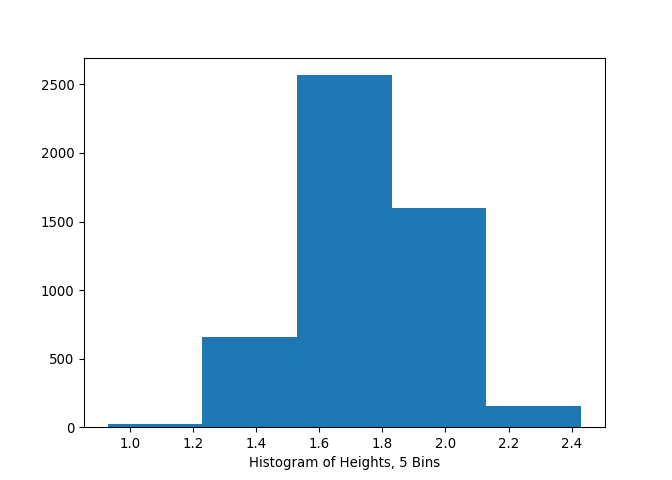

DataCamp Intermediate Python
================
Mark Blackmore
April 23, 2018

Source for setup script: <https://stackoverflow.com/questions/36437028/rstudio-with-python-matplotlib-graph>

Basic Plots with Matplotlib
---------------------------

``` python
# Import matplotlib.pyplot
import matplotlib.pyplot as plt
year = [1950, 1970, 1990, 2010]
pop = [2.519, 3.692, 5.263, 6.972]
# Line plot
plt.plot(year, pop)
plt.xlabel('Year')
plt.ylabel('Population')
plt.show()
```


``` python
plt.clf()
#Scatter plot
plt.scatter(year, pop)
plt.xlabel('Year')
plt.ylabel('Population')
plt.show()
```


``` python
plt.clf()
# Import numpy
import numpy as np
# Generate data
height = np.round(np.random.normal(1.75, 0.20, 5000),2)
weight = np.round(np.random.normal(60.32, 15, 5000),2)
# Histogram
plt.hist(height, bins = 5)
plt.xlabel('Histogram of Heights, 5 Bins')
plt.show()
```



``` python
plt.clf()
```

Dictionaries
------------

``` python
# Definition of countries and capital
countries = ['spain', 'france', 'germany', 'norway']
capitals = ['madrid', 'paris', 'berlin', 'oslo']
# Get index of 'germany': ind_ger
ind_ger = countries.index('germany')
# Use ind_ger to print out capital of Germany
print(capitals[ind_ger])
# From string in countries and capitals, create dictionary europe
```

    ## berlin

``` python
europe = {
    'spain':'madrid',
    'france': 'paris',
    'germany':'berlin',
    'norway':'oslo'
    }
# Print europe
print(europe)
# Print out the keys in europe
```

    ## {'spain': 'madrid', 'france': 'paris', 'germany': 'berlin', 'norway': 'oslo'}

``` python
print(europe.keys())
# Print out value that belongs to key 'norway'
```

    ## dict_keys(['spain', 'france', 'germany', 'norway'])

``` python
print(europe['norway'])
# Add italy to europe
```

    ## oslo

``` python
europe['italy'] = 'rome'
# Print out italy in europe
print('italy' in europe)
# Add poland to europe
```

    ## True

``` python
europe['poland'] = 'warsaw'
# Print europe
print(europe)
# New Definition of dictionary
```

    ## {'spain': 'madrid', 'france': 'paris', 'germany': 'berlin', 'norway': 'oslo', 'italy': 'rome', 'poland': 'warsaw'}

``` python
europe = {'spain':'madrid', 'france':'paris', 'germany':'bonn',
          'norway':'oslo', 'italy':'rome', 'poland':'warsaw',
          'australia':'vienna' }
# Update capital of germany
europe['germany'] = 'berlin'
# Remove australia
del(europe['australia'])
# Print europe
print(europe)
```

    ## {'spain': 'madrid', 'france': 'paris', 'germany': 'berlin', 'norway': 'oslo', 'italy': 'rome', 'poland': 'warsaw'}

More Dictionaries
-----------------

``` python
# Dictionary of dictionaries
europe = { 'spain': { 'capital':'madrid', 'population':46.77 },
           'france': { 'capital':'paris', 'population':66.03 },
           'germany': { 'capital':'berlin', 'population':80.62 },
           'norway': { 'capital':'oslo', 'population':5.084 } }
# Print out the capital of France
print(europe['france']['capital'])
# Create sub-dictionary data
```

    ## paris

``` python
data = { 'capital':'rome', 'population':59.83 }
# Add data to europe under key 'italy'
europe['italy'] = data
# Print europe
print(europe)
```

    ## {'spain': {'capital': 'madrid', 'population': 46.77}, 'france': {'capital': 'paris', 'population': 66.03}, 'germany': {'capital': 'berlin', 'population': 80.62}, 'norway': {'capital': 'oslo', 'population': 5.084}, 'italy': {'capital': 'rome', 'population': 59.83}}
